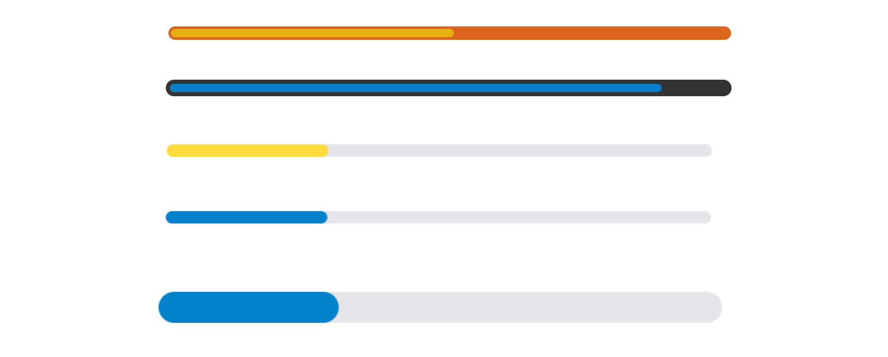
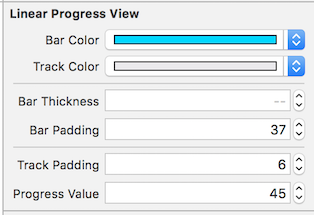
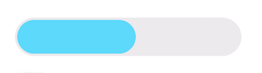
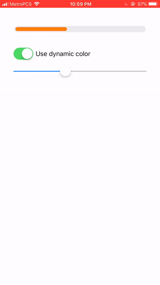

# LinearProgressBar

LinearProgressBar is a simple progress indicator control for iOS.



[](http://cocoapods.org/pods/LinearProgressBar)
[](http://cocoapods.org/pods/LinearProgressBar)
[](http://cocoapods.org/pods/LinearProgressBar)

## Usage

To run the example project, clone the repo, and run the example xcode project.

Setup is very easy:

    1. Create a UIView in Storyboard. 
    2. Set the custom class to LinearProgressView

### Customization

Customize your progress bar with these parameters:



- barColor: The color of the progress bar
- trackColor: The color of the base layer(track) of the progress bar
- barThickness: Controls how wide the progress bar is




### Dynamic Colors

Adjust bar color based on progressValue by providing a closure. Defaults to the color set in the storyboard/IB.



*Example*

```swift
linearProgressView.barColorForValue = { value in
	switch value {
	case 0..<20:
		return UIColor.redColor()
	case 20..<60:
		return UIColor.orangeColor()
	case 60..<80:
		return UIColor.yellowColor()
	default:
	return UIColor.greenColor()
	}
}

```

## Installation

LinearProgressBar is available through [CocoaPods](http://cocoapods.org). To install
it, simply add the following line to your Podfile:

```ruby
pod "LinearProgressBar"
```

## Author

Eliel Gordon, gordoneliel@gmail.com

## License

LinearProgressBar is available under the MIT license. See the LICENSE file for more info.

